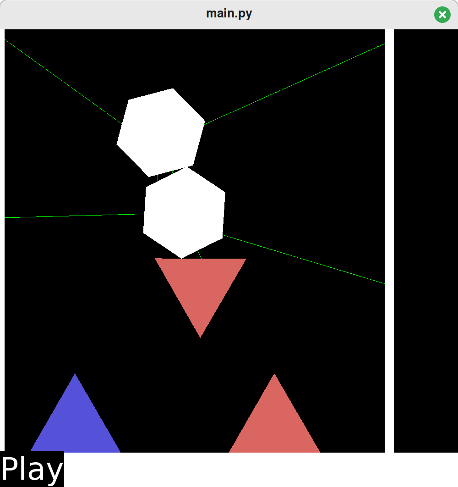
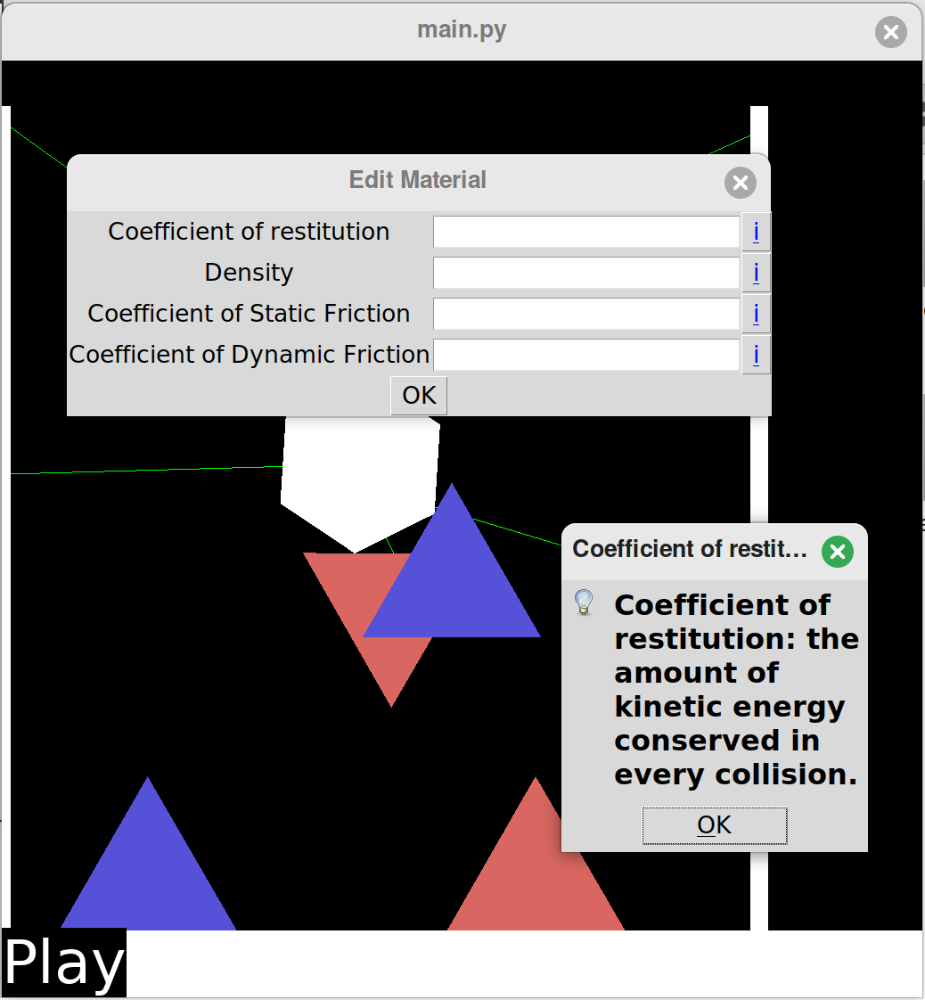

2-D Physics Simulator
=====================

This is a 2-D Physics simulator I wrote for a school project when I was 18.

I used a mixture of object-oriented and functional design pattern, based on what
felt more appropriate at the time.

It uses Python and Pyglet. If you want to try it out, I'd recommend grabbing an
old version of Pyglet from around 2019. If you want a decent framerate, I'd
suggest using PyPy.

## Notable features

- Interactive real-time user interface

- GUI elements to edit various properties

- Serialisation and deserialisation

- Collision detection of convex polygons

- Collision resolution (this was a really hard bit)

- Static and dynamic friction

- Inertia and rotational inertia

- Springs pulling two objects together (more accurately "strings")

- Verlet integration

## Screenshots

